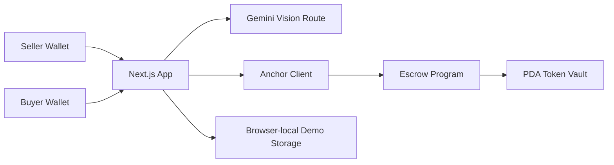

# TrustLayer

**AI-assisted, non-custodial escrow for P2P marketplace deals — built on Solana.**

TrustLayer doesn't try to replace Facebook Marketplace, Telegram, or Discord — it sits on top of
them. A seller shares a TrustLayer link instead of their bank details or a "friends & family"
payment. The buyer's payment is locked in a real Solana smart contract instead of being held by
any platform, and an AI model gives an *advisory* trust signal on the listing photos and, later,
on delivery evidence — a helper, not a gate. Funds only ever move when the buyer chooses to
release them on-chain.

> Built in a 3-hour hackathon. Two-person team: one frontend/AI engineer, one Solana/Anchor engineer.

## Table of contents

- [How it works](#how-it-works)
- [Architecture](#architecture)
- [Tech stack](#tech-stack)
- [Project layout](#project-layout)
- [Setup](#setup)
- [Environment variables](#environment-variables)
- [Token setup](#token-setup-devnet-usdc-or-demo-usdc)
- [Anchor program](#anchor-program)
- [Toolchain notes](#toolchain-notes)
- [Demo script](#demo-script-3-minutes)
- [Roadmap](#roadmap)

## How it works

1. **Seller** creates a listing (title, description, price, 1-3 photos). Gemini reviews the
   listing and returns an advisory risk score + reasons. The listing is saved to `localStorage`
   and gets a shareable `/listing/<id>` link — no signup, no database.
2. **Seller** connects a wallet and "activates" the listing, which calls `initialize_escrow` on
   the Anchor program, deriving a PDA escrow account and a PDA-owned token vault for that listing.
3. **Buyer** opens the link, connects a different wallet, and deposits the listed price (in USDC
   or a demo fallback token) into the vault via the `deposit` instruction. Funds now sit in the
   program, not with TrustLayer or the seller.
4. **Seller** simulates delivery by uploading a "proof of delivery" photo. Gemini compares it
   against the original listing photos and flags whether they plausibly show the same item.
5. **Buyer** reviews the comparison result and calls `release`, which pays the seller directly
   from the vault. TrustLayer's backend never touches the funds at any point.

The AI is explicitly advisory: the UI never says "verified safe," and no AI result blocks any
escrow action — a vision model can't reliably prove ownership, authenticity, or delivery. See
[`lib/ai/risk.ts`](lib/ai/risk.ts) for the prompts and the deterministic mock fallback used when
no Gemini API key is configured.

## Architecture



- **Web app** — Next.js (App Router) + TypeScript + Tailwind CSS.
- **Wallet / chain client** — Solana wallet adapter + a typed Anchor client wrapper in `lib/solana/`.
- **AI** — one server route (`app/api/analyze`) calling Gemini multimodal structured output, with a
  deterministic mock fallback so demos never depend on external API availability.
- **On-chain program** — Anchor, one escrow PDA + one PDA-owned associated token vault per listing.
- **Persistence** — listing metadata and compressed image previews live in the browser's
  `localStorage`; only a listing ID goes in the shared URL. No images or listing text touch the chain.

## Tech stack

Next.js · TypeScript · Tailwind CSS · Solana web3.js · Anchor (Rust) · SPL Token · Google Gemini
(`@google/generative-ai`) · Solana Wallet Adapter

## Project layout

```
app/                       Next.js pages
  page.tsx                 Create-listing flow (seller)
  listing/[id]/page.tsx     Transaction hub: activate / deposit / deliver / release
  api/analyze/route.ts      AI risk-analysis endpoint (Gemini + mock fallback)
components/                Trust score card, escrow timeline, image dropzone, wallet button, Explorer links
lib/
  ai/risk.ts                AI prompts, schema, and deterministic mock scorer
  solana/constants.ts       RPC / program / token configuration
  solana/client.ts          Typed Anchor helpers: createEscrow, depositEscrow, releaseEscrow, fetchEscrow
  storage.ts                localStorage-backed listing persistence
programs/trustlayer/        Anchor program (initialize_escrow, deposit, release)
tests/trustlayer.ts         Anchor/Mocha integration tests
scripts/create-demo-mint.ts One-off script to mint a fallback "Demo USDC" SPL token
scripts/mint-demo-usdc.ts  Top up an existing Demo USDC mint for more wallets/testing
target/idl/, target/types/  Hand-maintained IDL + TS types (see Toolchain notes)
```

## Setup

```bash
npm install
cp .env.example .env.local   # fill in values, see below
npm run dev
```

Open http://localhost:3000. The app runs out of the box in AI-mock mode; you only need real
credentials for a live devnet demo (see below).

## Environment variables

| Variable | Purpose |
| --- | --- |
| `NEXT_PUBLIC_SOLANA_RPC_URL` | Devnet RPC endpoint (public default works fine). |
| `NEXT_PUBLIC_PROGRAM_ID` | Deployed Anchor program ID. |
| `NEXT_PUBLIC_DEMO_MINT` | SPL token mint used for deposits. Leave blank until you've created/obtained one (see below); the deposit button is disabled without it. |
| `NEXT_PUBLIC_TOKEN_DECIMALS` / `NEXT_PUBLIC_TOKEN_LABEL` | Cosmetic + math config for the token above. |
| `GEMINI_API_KEY` | Enables real Gemini vision analysis. Omit to use the deterministic mock scorer. |
| `MOCK_AI` | Set to `true` to force the mock scorer even with a key set (useful for a guaranteed-reliable demo). |

## Token setup (devnet USDC or Demo USDC)

The escrow accepts any SPL token; preference order is real devnet USDC, falling back to a
project-owned six-decimal "Demo USDC" mint:

```bash
# Only if you have real devnet USDC: paste its mint address into NEXT_PUBLIC_DEMO_MINT.

# Otherwise, mint your own demo token and fund one or more wallets:
npm run create-demo-mint -- <buyerWalletPubkey> [sellerWalletPubkey...]
# then paste the printed mint address into NEXT_PUBLIC_DEMO_MINT

# To top up more Demo USDC to wallets later (reuses the existing mint):
npm run mint-demo-usdc -- <pubkey> [pubkey...] --amount 1000 --mint <mintAddress>
```

This requires `keys/deployer.json` (the program's fee-payer keypair, gitignored) to hold a small
amount of devnet SOL — see [Toolchain notes](#toolchain-notes) if the public faucet is rate-limited.

## Anchor program

```bash
anchor build --no-idl   # see Toolchain notes for why --no-idl
anchor test --skip-build
anchor deploy --provider.cluster devnet
```

On-chain design — one PDA escrow account + one PDA-owned associated token vault per listing:

- `initialize_escrow(id, amount)` — seller-signed. Records seller, buyer slot, mint, amount, sets `Created`.
- `deposit()` — buyer-signed. Transfers `amount` of `mint` from the buyer into the vault, sets `Funded`.
- `release()` — buyer-signed. Transfers the vault balance to the seller's associated token account, sets `Released`.

Enforced invariants (see `tests/trustlayer.ts`): only the recorded buyer can release, deposits must
use the escrow's own mint, and every instruction checks the escrow is in the expected status before
acting.

## Toolchain notes

A few environment quirks came up building this; documenting them so nobody has to re-debug them:

- **`anchor build`'s automatic IDL generation can fail** on newer nightly Rust toolchains (an
  `anchor-syn` macro depends on an unstable `proc_macro2` API that has since moved). If you hit a
  "could not create temp file" / nightly sync error, build with `anchor build --no-idl` and use the
  hand-written `target/idl/trustlayer.json` / `target/types/trustlayer.ts` in this repo instead of
  regenerating them. Keep both files' account/type names in sync manually if you change `lib.rs`:
  the raw IDL JSON uses Rust's snake_case/PascalCase, but the `.ts` types file must use the
  camelCase names Anchor's JS client actually looks up (`initializeEscrow`, `escrow`, `escrowStatus`, etc).
- **The devnet airdrop faucet rate-limits aggressively** from shared/CI-like IPs. If `solana
  airdrop` keeps failing, retry with delays between attempts, use a browser-based faucet
  (faucet.solana.com, QuickNode's devnet faucet, etc.) from a different network, or generate a
  fresh keypair — some faucets also rate-limit per destination address.
- Solana CLI keypair generation can fail with "Operation not permitted" if your environment blocks
  writes to `~/.config/solana/`. This repo instead keeps a project-local deploy keypair at
  `keys/deployer.json` (gitignored) and points `Anchor.toml`'s `wallet` field at it.

## Demo script (~3 minutes)

1. Explain the problem: P2P deals on Facebook/Telegram/Discord have no neutral settlement layer.
2. Create a listing, show the AI's advisory review (not a verdict).
3. Switch wallets, deposit into escrow, show the vault balance + Explorer transaction proving
   TrustLayer never held the funds.
4. Simulate delivery, upload the evidence photo, show the AI's match assessment.
5. Release funds as the buyer, show the seller's balance change + Explorer transaction.
6. Close: "Next steps are dispute arbitration, shipping-provider attestations, and production
   stablecoin support."

## Roadmap

- Dispute arbitration / partial refunds
- Shipping-provider delivery attestations instead of simulated delivery
- Production stablecoin support (real USDC, mainnet)
- Multi-listing seller dashboard, notifications, and account history
